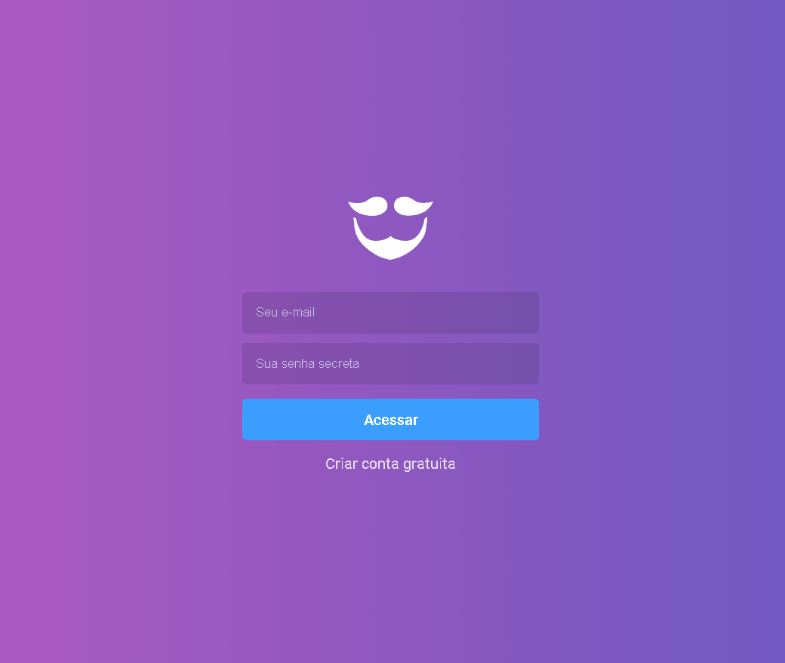

# GoBarber ReactJS

Esse projeto utiliza ReactJS para criar o agendamento de barberia - GoBarber.

# Demo

## Technologies Used
* HTML
* CSS
* ReactJS
* Redux
* Redux Saga

## License

The code in this project is licensed under the MIT License. See [LICENSE](LICENSE) for details.